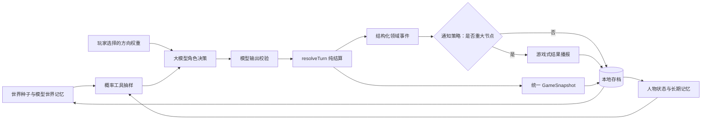
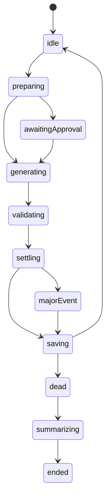
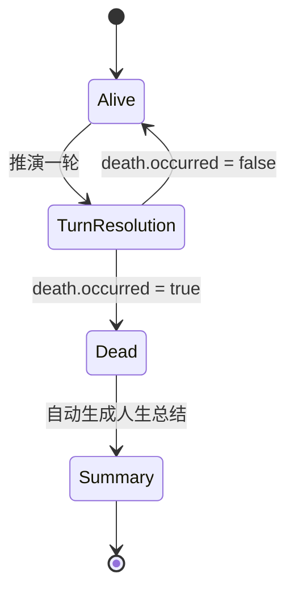

# 人生分岔口：模拟架构

## 设计原则

- 世界新闻和人物事件由大模型基于世界种子与历史现场生成，代码不保存固定剧情池。
- 人物先按年龄、人格、记忆、关系和玩家选择形成行动，外部结果再由概率工具独立抽样。事件年概率会按每轮实际月数换算，负债读取统一资产负债表口径。
- 财务、关系、技能、身体、人格和世界状态都写回存档，下一轮只能继承，不能重置。
- 人物可能在自动暂停年龄之前死亡。死亡必须有事件因果与概率依据，发生后人生状态不可继续推进。

## 回合数据流



## 回合执行状态机



非法转移会被状态机拒绝。React 只根据当前阶段显示加载、审批、弹窗或结束界面，不再用多个布尔值隐式拼接流程。

## 快照与领域事件

`resolveTurn(currentSnapshot, modelOutput, approval)` 是结算层单一入口。它统一结算财务、身体、人格、技能、关系、NPC 生命周期和时间推进，并一次性返回：

```text
{ snapshot, domainEvents, notification }
```

领域事件使用稳定类型，例如 `asset.majorChanged`、`relationship.changed`、`world.eventUpdated`、`life.milestoneReached` 和 `life.ended`。通知系统消费这些事件，核心逻辑不再依赖 UI 从标题中重复判断。

每一轮根据人物、世界、月份和回合号生成固定随机种子。审批抽样、事件抽样、结果方向、年龄事件和生活领域使用相互隔离的派生随机流；相同输入可复现相同概率结果。

## 人生终止状态机



死亡判定由模型输出 `death`：

```json
{
  "occurred": true,
  "cause": "具体死因",
  "age": 43,
  "summary": "克制描述死亡经过和直接影响"
}
```

青壮年死亡通常要求概率工具命中严重事故或健康事件；已有危重病史、极低健康值或高龄可以提高合理性。`endAge` 只是自动暂停年龄，不等于死亡年龄。

## 游戏反馈素材

只有死亡、里程碑、高强度世界事件、房车或大额资产变化、显著状态或关系变化才弹出播报；普通回合直接写回界面。播报通过结算类型选择通用视觉素材：

| 类型 | 判定                                 | 素材                  |
| ---- | ------------------------------------ | --------------------- |
| 成功 | `outcomeAudit.direction = favorable` | `result-success.png`  |
| 失败 | `outcomeAudit.direction = adverse`   | `result-failure.png`  |
| 努力 | mixed / stagnant / 普通积累          | `result-effort.png`   |
| 结婚 | 回合内容命中婚姻里程碑               | `result-marriage.png` |
| 死亡 | `death.occurred = true`              | `result-death.png`    |

## 关键模块

- `src/App.jsx`：UI 编排和状态机命令，不承担领域结算。
- `src/simulation/gameMachine.js`：显式回合与死亡生命周期状态机。
- `src/simulation/turnResolver.js`：纯回合结算入口。
- `src/simulation/domainEvents.js`：领域事件与重大通知策略。
- `src/simulation/snapshot.js`：统一快照和存档序列化。
- `src/utils/prng.js`：可复现的分流随机数生成器。
- `src/services/llm.js`：模型上下文、世界事件输出、死亡约束与人生总结。
- `src/simulation/probabilityTools.js`：独立概率抽样接口。
- `src/simulation/probabilityModel.js`：按回合跨度换算事件概率，并计算有利、得失并存、不利和平淡四类结果概率。
- `src/simulation/worldModel.js`：模型世界记忆的归一化和传导。
- `src/simulation/directionModel.js`：动态人生方向与长期权重。
- `src/components/TurnBulletinModal.jsx`：游戏式结算反馈和通用素材选择。
