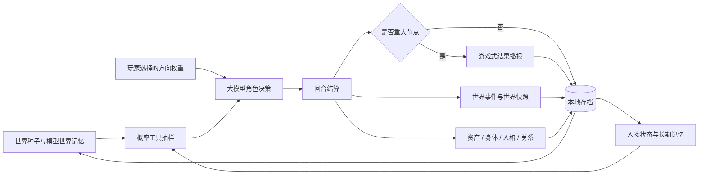
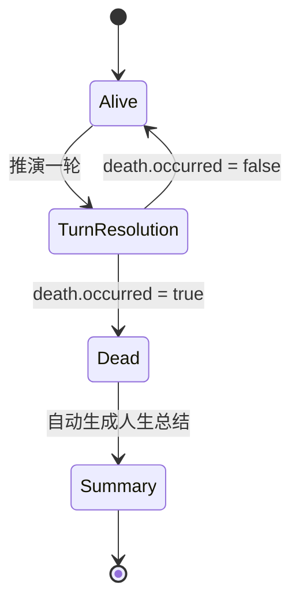

# 人生分岔口：模拟架构

## 设计原则

- 世界新闻和人物事件由大模型基于世界种子与历史现场生成，代码不保存固定剧情池。
- 人物先按年龄、人格、记忆、关系和玩家选择形成行动，外部结果再由概率工具独立抽样。事件年概率会按每轮实际月数换算，负债读取统一资产负债表口径。
- 财务、关系、技能、身体、人格和世界状态都写回存档，下一轮只能继承，不能重置。
- 人物可能在自动暂停年龄之前死亡。死亡必须有事件因果与概率依据，发生后人生状态不可继续推进。

## 回合数据流



## 人生终止状态机



死亡判定由模型输出 `death`：

```json
{
  "occurred": true,
  "cause": "具体死因",
  "age": 43,
  "summary": "克制描述死亡经过和直接影响"
}
```

青壮年死亡通常要求概率工具命中严重事故或健康事件；已有危重病史、极低健康值或高龄可以提高合理性。`endAge` 只是自动暂停年龄，不等于死亡年龄。

## 游戏反馈素材

只有死亡、里程碑、高强度世界事件、房车或大额资产变化、显著状态或关系变化才弹出播报；普通回合直接写回界面。播报通过结算类型选择通用视觉素材：

| 类型 | 判定                                 | 素材                  |
| ---- | ------------------------------------ | --------------------- |
| 成功 | `outcomeAudit.direction = favorable` | `result-success.png`  |
| 失败 | `outcomeAudit.direction = adverse`   | `result-failure.png`  |
| 努力 | mixed / stagnant / 普通积累          | `result-effort.png`   |
| 结婚 | 回合内容命中婚姻里程碑               | `result-marriage.png` |
| 死亡 | `death.occurred = true`              | `result-death.png`    |

## 关键模块

- `src/App.jsx`：回合编排、状态写回、存档、死亡终止与总结触发。
- `src/services/llm.js`：模型上下文、世界事件输出、死亡约束与人生总结。
- `src/simulation/probabilityTools.js`：独立概率抽样接口。
- `src/simulation/probabilityModel.js`：按回合跨度换算事件概率，并计算有利、得失并存、不利和平淡四类结果概率。
- `src/simulation/worldModel.js`：模型世界记忆的归一化和传导。
- `src/simulation/directionModel.js`：动态人生方向与长期权重。
- `src/components/TurnBulletinModal.jsx`：游戏式结算反馈和通用素材选择。
